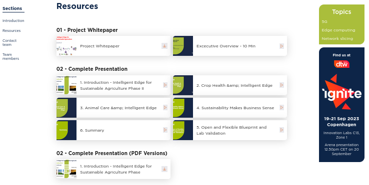

# TMF-DTW-2023-Resources

Thank you for scanning our QR Code. Often times when we're walking around an industry event we don't have the necessary time to review information. This GitHub repository exists to help provide longer-lasting resources to our Catalyst Project. 
Again, thank you for taking the time to review these resources and your interest in our project.

### Main TM Forum Digital Transformation World 2023 - Catalyst Page

<a href="https://www.tmforum.org/catalysts/projects/C23.0.504" target="_blank">Visit the Catalyst Project Page</a>

### Complete 35 Min. Presentation of our Project

1. <a href="https://youtu.be/STHplX84RN4" target="_blank">Introduction - Intelligent Edge for Sustainable Agriculture Phase II</a>

2. <a href="https://youtu.be/GS_OYptHLwU" target="_blank">Crop Health & Intelligent Edge</a>

3. <a href="https://youtu.be/uJPo2h4s3Gw" target="_blank">Animal Care & Intelligent Edge</a>

4. <a href="https://youtu.be/qWm-VTg1CY8" target="_blank">Sustainability Makes Business Sense</a>

5. <a href="https://youtu.be/vFEXru8IIvw" target="_blank">Open and Flexible Blueprint and Lab Validation</a>

6. <a href="https://youtu.be/0dBMu2nZqkk" target="_blank">Summary</a>
